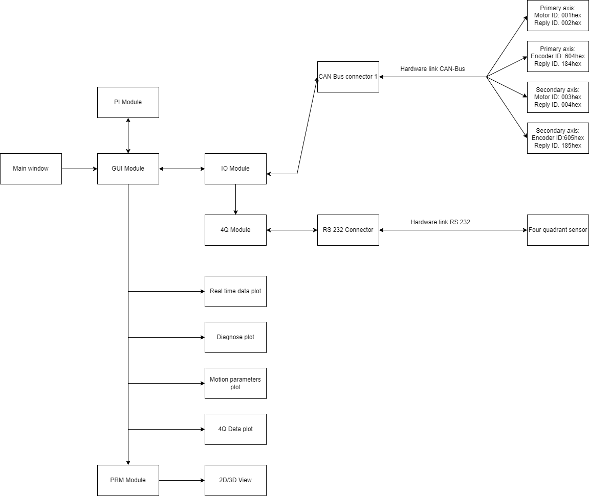

# Overview

A Heliostat is a system of two flat mirrors that are able to direct a solar beam into a fixed direction. It consists of one moveable mirror and a fixed mirror. At PMOD/WRC in Davos there is a Heliostat installed that directs the solar beam into a vacum chamber. For further information on how the Heliostat was built read the dissertation of Markus Suter who built the Heliostat.

The Heliostat has six modes of operation that are controlled via a PC located in the laboratory:

- **Home:** The Heliostat moves to a defined home position
- **Go to position:** The Heliostat moves to a given position that is given by the operator
- **Passive sun tracking:** The Heliostat tracks the sun based on date and time
- **Active sun tracking:** The Heliostat uses additionally to the passive tracking a four quadrant photodetector to allow better sun tracking
- **Star tracking:** The Heliostat uses the right ascension and declination of a star to track him
- **Manual remote mode:** The Heliostat can be controlled via two switches on the outside of the building

The controll software of the Heliostat was written with MATLAB. Because MATLAB isn't an open source programming language the controll software is now written in Python. This documentation is here to show how to install the controll software on a PC in the lab and it explains the Python code behind it.

The Python code consists of several different modules that have controll different parts of the Heliostat. This modules are explained in detail in the [Reference](reference/gui.md) section of the documentation.

The [GUI Module](reference/gui.md) works as the main module of the software and controlls all other modules. It controlls the [IO Module](reference/io.md) which is connected to the CAN Bus and communicates with the motors and the encoders from the Heliostat. Furthermore the [IO Module](reference/io.md) also controlls the 4Q Sensor over the [4Q Module](reference/fourq.md). The data that is gathered from this two modules is later used to calculate the movement of the Heliostat. When the Heliostat is in active or passive tracking mode the [PI Module](reference/pi.md) is used. This modules works as a proportional-integral controller and calculates the speed for the mirror. To make the different plots in the GUI the [PRM Module](reference/prm.md) is used to calculate the vectors and positions of the mirrors to eachother.

The construction of the Heliostat and the further information on the used motors and encoders is provided in the [Hardware section](hardware.md).

